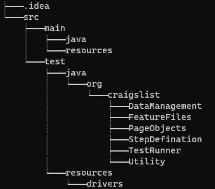
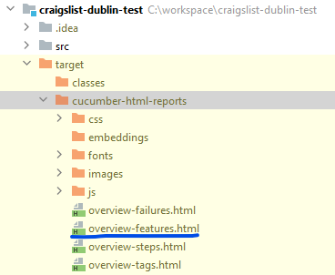

# <u>**Craigslist Dublin Test Framework**</u>

# <u>**Tools and Technologies:**</u>

 **1. Language: Java**

 **2. Testing framework: Testng**

 **3. BDD framework: Cucumber jvm**

 **4. Automation tool: Selenium webdriver**

 **5. Build tool: maven**

 **6. Reporting: cucumber reporting**

# <u>**Running Tests:**</u>

**$ mvn clean install**

# <u>**Project Tree:**</u>

# <u>**Test Report:**</u>

**Once test execution is completed, go to target/cucumber-html-reports folder and open overview-features.html file**

